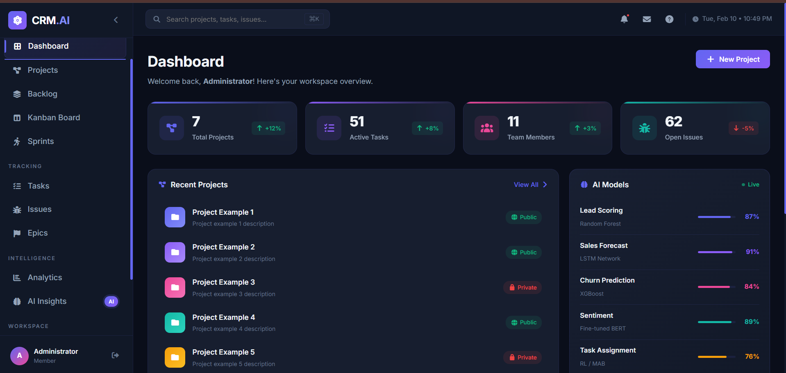
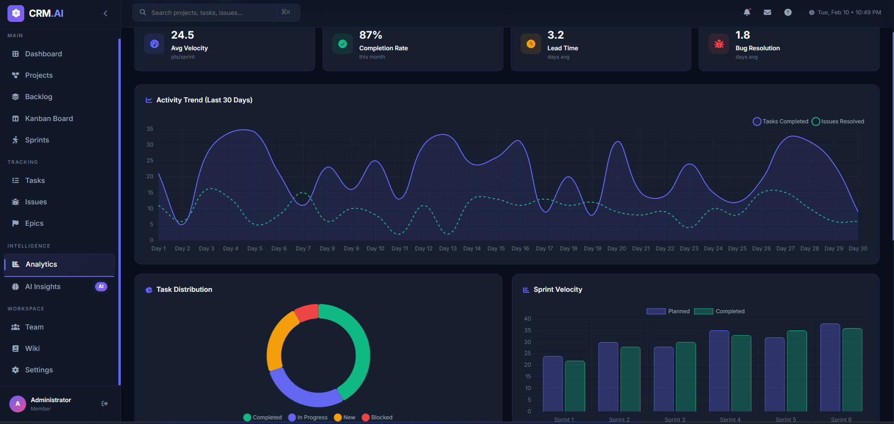
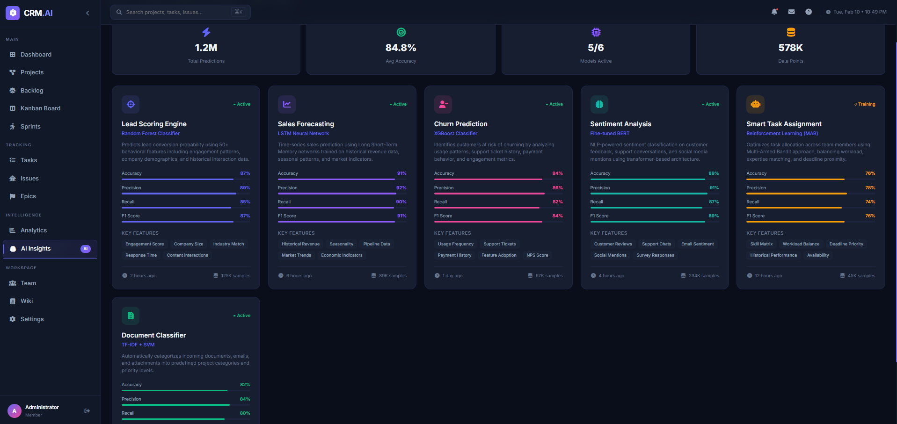
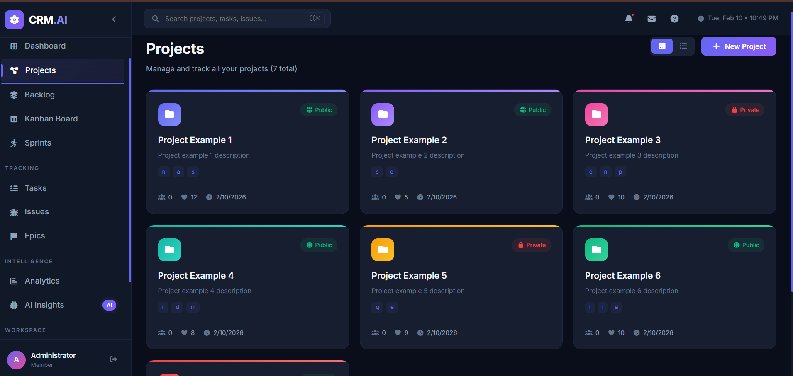
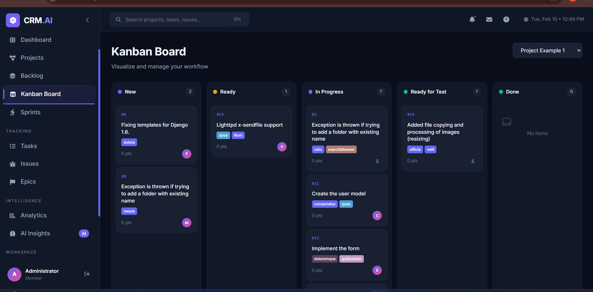
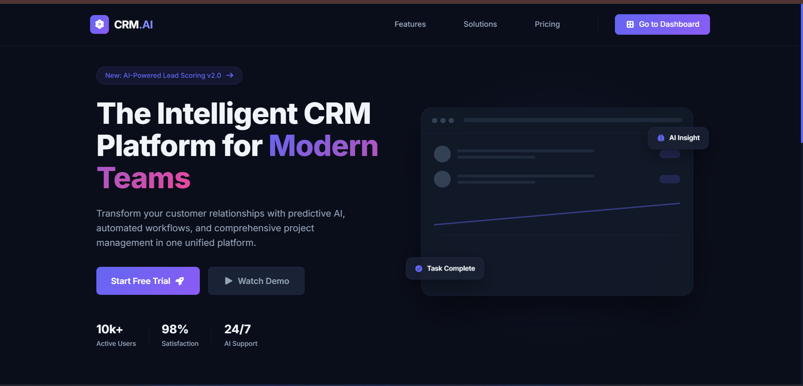
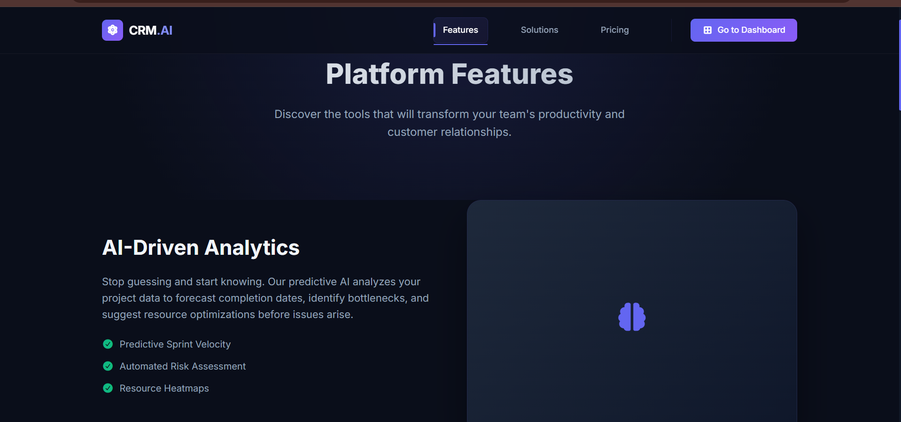
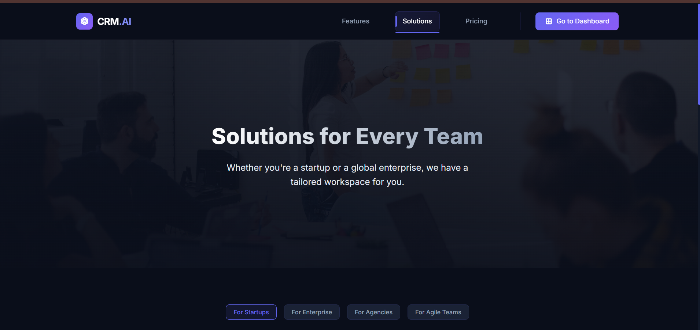
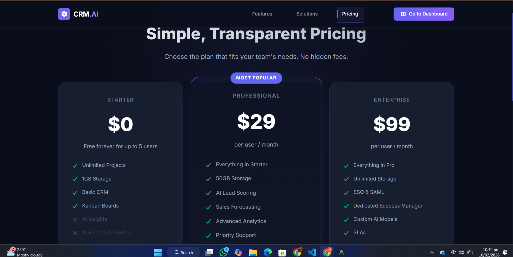

# AI-Driven Full-Stack CRM Project Management

A powerful, AI-driven SaaS CRM and Project Management platform designed to streamline business operations, enhance team collaboration, and provide actionable insights through advanced analytics.

## 🚀 Features

- **AI-Powered Insights**: Get intelligent recommendations and analytics to drive decision-making.
- **Project Management**: Comprehensive tools for task tracking, sprints, and milestones.
- **CRM Integration**: Manage customer relationships, leads, and sales pipelines effectively.
- **Real-time Collaboration**: Team communication and updates in real-time.
- **Interactive Dashboards**: Visual data representation using Chart.js.
- **Secure & Scalable**: Built with a robust Django backend and modern React frontend.

## 🛠️ Tech Stack

### Frontend
- **React 19**: Modern UI library for building interactive interfaces.
- **Vite**: Next-generation frontend tooling for fast builds.
- **Chart.js**: For dynamic data visualization.
- **Axios**: HTTP client for API communication.

### Backend
- **Python & Django**: High-level Python web framework for rapid development.
- **Celery & Redis**: Asynchronous task queue for background processing.
- **PostgreSQL**: Robust relational database management system.
- **Django REST Framework**: For building powerful Web APIs.

## 📸 Screenshots

<!-- Add your screenshots here -->
<div align="center">
  <h3>📊 Dashboard & Analytics</h3>
  
  <br/>
  <em>Start your day with a comprehensive overview of your business metrics.</em>
  <br/><br/>
  
  
  <br/>
  <em>Deep dive into data with our advanced analytics tools.</em>
  <br/><br/>

  
  <br/>
  <em>Leverage AI to get actionable insights and predictions.</em>
</div>

<br/>

<div align="center">
  <h3>📅 Project Management</h3>
  
  <br/>
  <em>Manage all your projects in one centralized view.</em>
  <br/><br/>

  
  <br/>
  <em>Track progress visually with our intuitive Kanban boards.</em>
</div>

<br/>

<div align="center">
  <h3>🌐 Core Platform</h3>
  
  <br/>
  <em>A welcoming and informative landing page for your users.</em>
  <br/><br/>

  
  <br/>
  <em>Explore the powerful features that drive your business forward.</em>
  <br/><br/>

  
  <br/>
  <em>Tailored solutions to meet your specific industry needs.</em>
  <br/><br/>

  
  <br/>
  <em>Transparent and flexible pricing plans for every stage of growth.</em>
</div>

## 🔧 Installation & Setup

### Prerequisites
- Node.js & npm
- Python 3.8+
- PostgreSQL
- Redis

### Backend Setup

1. Clone the repository:
   ```bash
   git clone https://github.com/Mostafa-Anwar-Sagor/AI-Driven-Full-Stack-CRM-Project-Management.git
   cd AI-Driven-Full-Stack-CRM-Project-Management
   ```

2. Create and activate a virtual environment:
   ```bash
   python -m venv venv
   source venv/bin/activate  # On Windows: venv\Scripts\activate
   ```

3. Install dependencies:
   ```bash
   pip install -r requirements.txt
   ```

4. Configure environment variables (create a `.env` file).

5. Run migrations:
   ```bash
   python manage.py migrate
   ```

6. Start the development server:
   ```bash
   python manage.py runserver
   ```

### Frontend Setup

1. Navigate to the frontend directory:
   ```bash
   cd frontend
   ```

2. Install dependencies:
   ```bash
   npm install
   ```

3. Start the development server:
   ```bash
   npm run dev
   ```

## 🤝 Contributing

Contributions are welcome! Please feel free to submit a Pull Request.

## 📄 License

This project is licensed under the MIT License - see the [LICENSE](LICENSE) file for details.

## 👤 Author

**Mostafa Anwar Sagor**

*   [GitHub Profile](https://github.com/Mostafa-Anwar-Sagor)
*   [LinkedIn Profile](https://www.linkedin.com/in/mostafa-anwar-3ab665350/)

---
Made with ❤️ by Mostafa Anwar Sagor
